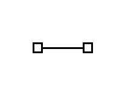
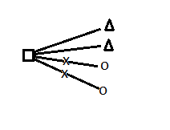
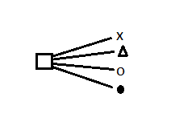

Comunicação de dados
===

elementos de comunicação
---

* Receptor
* transmissor
* canal
* mensagem
* protocolo

Canal
----
<table>
<tr><td>

|guiado|
|---|
|-cabo lan|
|-fibra óptica|
|-cabo de energia|
|-cabo coaxial|
||

</td><td>

|não guiado|
|---|
|-ondas eletromagneticas|
|-infravermelho|
|-lazer|
||
</td><td>

|
simplex  -------->   rx_____tx|
|---|
|tv, rádio|
|controle remoto|
||
</td><td>

|
half-duplex  -------->  rx_____tx  <--------|
|---|
|walk talk|
|fax|
||
</td><td>

|
duplex   <-------->  rx_______tx|
|---|
|celular|
|pc|
|roteador|
</td>
</table>

Propagação da informação
---
<table>
<td>

|unicast|
|---|
||
||
</td><td>

|multicast|
|---|
||
||
</td><td>

|broadcast|
|---|
||
||
</td>
</table>

<table><td>

|atenuação|
|---|
|potencia da tranmissão|
||

</td><td>

|largura de banda|
|---|
|medida de transmissão|
||****